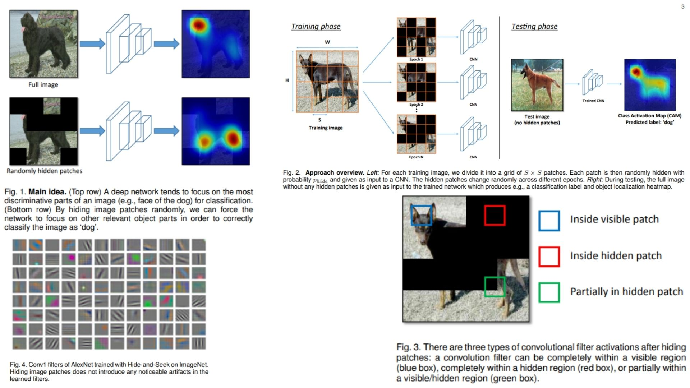

# 🎹 Hide-and-Seek Replication – Data Augmentation via Random Patch Hiding

This repository provides a **PyTorch-based replication** of  
**Hide-and-Seek – A Data Augmentation Technique for Weakly-Supervised Localization and Beyond**.

The focus is **understanding Hide-and-Seek augmentation**,  
rather than fully training models or maximizing benchmark accuracy.

- CNN backbone with **Hide-and-Seek layers** 🌀  
- Randomly hiding patches during training for **multi-part attention** 🪷  
- Setting hidden pixels to **dataset mean** for distribution consistency ⚖️  
- Demonstrates theoretical **robustness to occlusion** 🌾  

**Paper reference:** [Hide-and-Seek: Data Augmentation](https://arxiv.org/abs/1811.02545) 🔎

---

## ⛺️ Overview – Hide-and-Seek Architecture



### 🌿 High-level Pipeline

1. **Input image**

```math
I \in \mathbb{R}^{W \times H \times 3}
```

2. **Divide into S × S patches and randomly hide each patch with probability $$p_{hide}$$**

```math
I' = HideAndSeek(I, p_{hide})
```

3. **Feed into CNN backbone**

```math
F^{(l)} = f(W^{(l)} * F^{(l-1)}), \quad l=1..L
```

4. **Classification + CAM generation**

```math
\hat{Y} = FC(F^{(L)}), \quad CAM(c, I) = \sum_i W(c,i) \cdot F_i(I)
```

> $$I'$$ is the training image with hidden patches; $$CAM(c,I)$$ highlights discriminative regions for class $$c$$.

---

## 🌱 What the Model Demonstrates

- **Hide-and-Seek layers**: hide random patches → network learns multiple relevant parts 🌺  
- **Backbone**: extracts hierarchical features 🌿  
- **CAM generation**: visualize learned attention per class 🔥  
- **Hidden pixel mean**: ensures training vs testing distributions match ⚖️  
- **Forward-only**: theoretical replication; no training/test conducted 🧪  

---

## 📦 Repository Structure

```bash
HideAndSeek-Replication/
├── src/
│   ├── layers/
│   │   ├── conv_block.py         # Conv layers for CNN
│   │   ├── activation.py         # ReLU, GELU etc.
│   │   ├── normalization.py      # BatchNorm / LayerNorm
│   │   └── pooling.py             # Max / Avg pooling
│   │
│   ├── backbone/
│   │   ├── cnn_blocks.py         # VGG / ResNet style backbone blocks
│   │   └── feature_maps.py       # Expose last conv feature maps
│   │
│   ├── model/
│   │   └── hide_and_seek_cnn.py  # Main model
│   │
│   ├── hide_and_seek/
│   │   └── hide_and_seek_layer.py  # Patch hiding logic
│   │
│   ├── cam_generator.py          # Class Activation Map generation
│   │
│   └── config.py                 # Hyperparameters / training config
│
├── images/
│   └── figmix.jpg
│
├── requirements.txt
└── README.md
```

---

## 🔗 Feedback

For questions or feedback, contact: [barkin.adiguzel@gmail.com](mailto:barkin.adiguzel@gmail.com)
